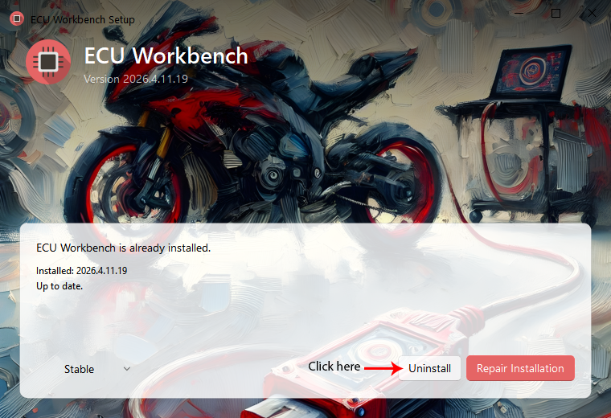
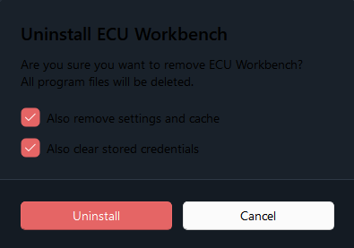
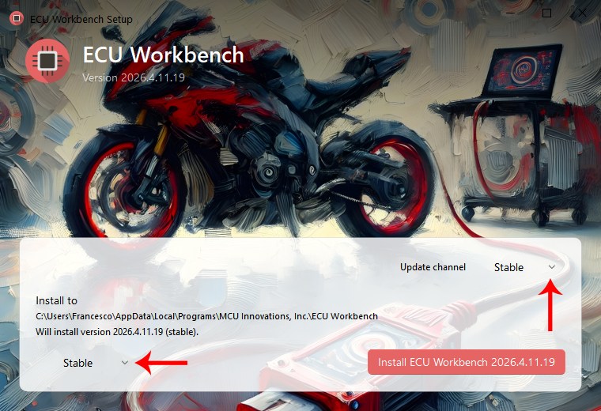

# Clean Uninstallation and Reinstallation Guide for ECU Workbench

This guide explains how to completely remove ECU Workbench from your system and reinstall it from scratch, avoiding conflicts, errors, or leftover files from previous versions.

## 🧹 1. Program Uninstallation
1. Download the web installer from mcuinnovations.com. (https://mcuinnovations.com/software/ecuwb/)

2. Run the installer and click “Uninstall”

3. Enable the two checkboxes as shown in the image, then click Uninstall

## 🔄 2. Operating System Restart

A restart ensures that:

- any locked files are released
- leftover processes are closed
- the system is ready for a clean installation
- 
## 💾 3. Clean Installation

1. Launch the Web Installer
   
2. In the two boxes indicated by the arrows, you can view and select which version to install (Stable or Development), then click Install

3. Start the program to verify that everything is working correctly.

## 🧪 4. Final Check

After installation, the program should start without errors.
If everything works correctly, the reinstallation is complete.

## 📌 Additional Notes

- If you encounter errors after reinstalling, report the issue including:
  - software version
  - operating system
  - any logs or screenshots

**Guide created to help users solve common issues without requiring support.**
